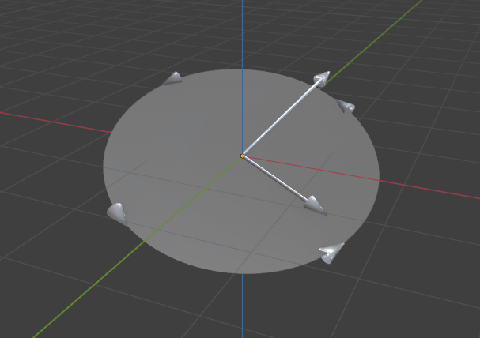

# Geomviz

Blender plugin for plotting geometric algebra elements in Julia and (eventually) Python.

```julia
julia> using GeometricAlgebra, Geomviz

julia> a, b = randn(Multivector{3,1}, 2)
2-element Vector{Multivector{3, 1}}:
 0.493594v1 + 2.0016v2 + 0.649108v3
 1.24931v1 + -0.33524v2 + -0.412193v3

blend> a, b, a∧b # press space to enter REPL mode
```




## Installation instructions

### Blender add-on

From 

### Julia extension for [`GeometricAlgebra.jl`](https://github.com/Jollywatt/GeometricAlgebra.jl)

### Python extension for [`clifford`](https://github.com/pygae/clifford)

## Serialisation format

```
{
	"rig": "Point",
	"animation": true,
	""
	"parameters": {
		"location": {
			"keyframes": [
				(frame, value),
			],
		},
	},
}
```
