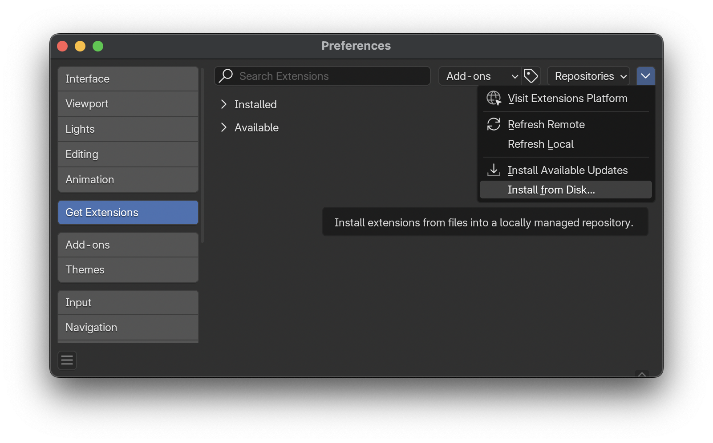
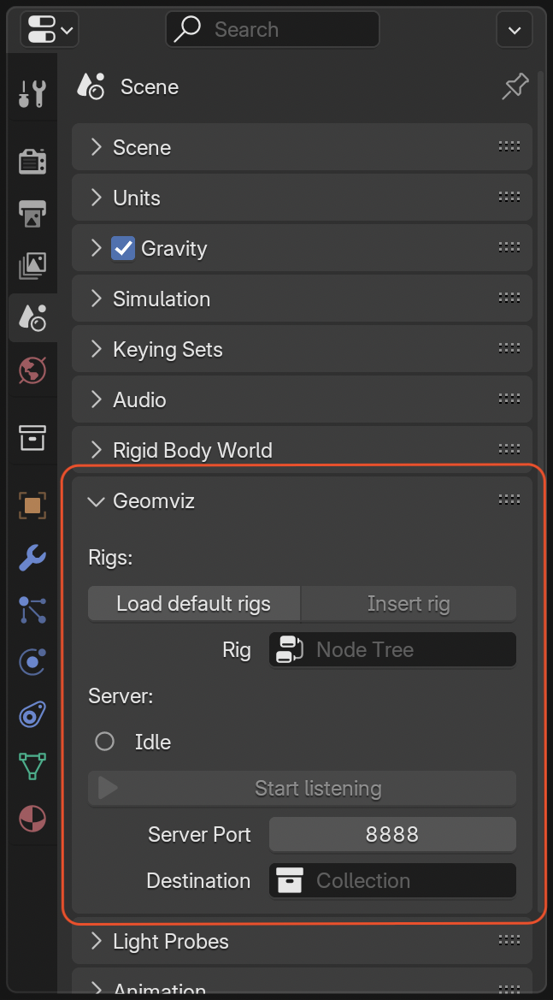

# Geomviz

Blender plugin for plotting geometric algebra elements in Julia and (eventually) Python.

Here is an example animation showing the action of a rotor on objects in conformal geometric algebra:


<details>
	<summary>Julia code</summary>

```julia
using GeometricAlgebra, Geomviz

o, oo = Conformal.origin(CGA{3}), Conformal.infinity(CGA{3})

x = up.(CGA, randn(Multivector{3,1}, 50)) # random points

# draw circles through random triplets of points
circles = [wedge(rand(x, 3)...) for _ in 1:3]

# create a normalized circle to define the rotor
p = up.(CGA, randn(Multivector{3,1}, 3))
c = wedge(rand(x, 3)...)
c /= sqrt(c⊙c)

animate(range(0, π, length=300)) do t
    R = exp(t*hodgedual(c))
    [
        Styled(c, color=(1,0.5,0,1)) # RGBA for orange circle
        sandwich_prod.(R, x) # rotate points
        sandwich_prod.(R, circles) # rotate circles
    ]
end
```

</details>


## Installation instructions

### Blender add-on

1. From the [releases page](https://github.com/Jollywatt/Geomviz/releases), download `geomviz_blender_v*.*.*.zip`.
2. Open Blender and drag and drop the ZIP file somewhere in main Blender window. (Alternatively, install manually with Edit → Preferences → Get Extensions → Install from Disk.)
	
3. With "Enable Add-on" checked, confirm installation.
4. You should now find a "Geomviz" panel under the Scene Properties tab.
	

### Julia client

The `Geomviz.jl` client package for Julia requires [`GeometricAlgebra.jl`](https://github.com/Jollywatt/GeometricAlgebra.jl).
To use it with the Blender add-on, you will need to install both these packages.

From the Julia REPL, run
```julia
julia> using Pkg

julia> Pkg.add(url="https://github.com/Jollywatt/GeometricAlgebra.jl")

julia> Pkg.add(url="https://github.com/Jollywatt/Geomviz", subdir="clients/Geomviz.jl")
```
or press `]` to enter the Pkg REPL-mode and run
```
pkg> add https://github.com/Jollywatt/GeometricAlgebra.jl
pkg> add https://github.com/Jollywatt/Geomviz:clients/Geomviz.jl
```

### Python client

The `geomviz_clifford` client package for Python requires [`clifford`](https://github.com/pygae/clifford).
To use it with the Blender add-on, you will need to install both these packages.

With `pip`, install with
```
pip install https://github.com/Jollywatt/Geomviz/releases/download/v0.0.1/geomviz_clifford-0.0.1-py3-none-any.whl
```

```python
>>> import geomviz_clifford
```