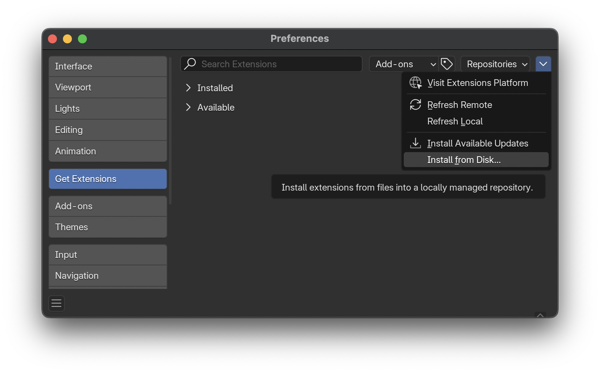
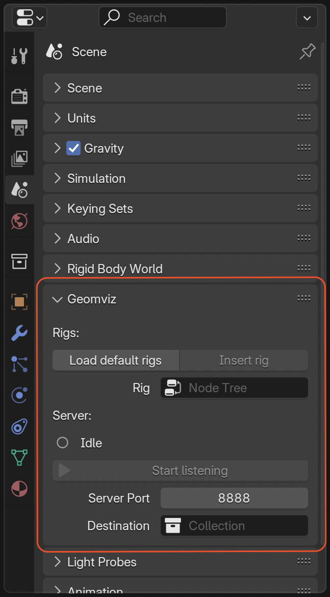

# Geomviz

Blender plugin for plotting geometric algebra elements in Julia and (eventually) Python.

Here is an example animation showing the action of a rotor on objects in conformal geometric algebra:

https://github.com/user-attachments/assets/d4324be5-e6e4-4ed2-a489-cfcfc862718f

<details>
	<summary>Julia code</summary>

```julia
using Geomviz
using GeometricAlgebra
using GeometricAlgebraModels.Conformal

o, oo = origin(CGA{3}), infinity(CGA{3})

# random 3d vector embedded into CGA as points
points = up.(randn(Multivector{3,1}, 50))

# circles through random triplets of points
circles = [wedge(rand(points, 3)...) for _ in 1:3]

# create a normalized circle to define the rotor
p = up.(randn(Multivector{3,1}, 3))
c = wedge(rand(points, 3)...)
c /= sqrt(c⊙c)

animate(range(0, π, length=300)) do t
    R = exp(t*hodgedual(c))
    [
        Styled(c, color=(1,0.5,0,1)) # RGBA for orange circle
        sandwich_prod.(R, points) # rotate points
        sandwich_prod.(R, circles) # rotate circles
    ]
end
```

</details>

# Installation and usage

## Blender add-on

### Installation

1. Download [Blender](https://www.blender.org).
1. From the [Geomviz releases page](https://github.com/Jollywatt/Geomviz/releases), download the Blender extension ZIP file `geomviz_blender_v*.*.*.zip`.
1. Open Blender and drag and drop the ZIP file somewhere in main Blender window, or install it via Edit → Preferences → Get Extensions → Install from Disk.
   
1. Confirm the installation with "Enable Add-on" checked.
1. You should now find a "Geomviz" panel under the Scene Properties tab.
   

### Usage

1. In the Geomviz panel, ensure the default rigs are loaded and a destination collection is selected.
   _Rigs_ are [geometry node](https://docs.blender.org/manual/en/latest/modeling/geometry_nodes/introduction.html) trees for procedurally generating geometric objects (such as arrows, circles, planes, etc).
   The Blender add-on comes with a set of predefined rigs for conformal geometric algebra.
1. Press "Start listening" to start a local background server which can receive data from a Geomviz client running in a separate process (such as Julia or Python).
1. From a Geomviz client (e.g., the Julia or Python REPL), create and send some geometric objects. They should immediately appear in the Blender 3D View.

## Julia client

### Installation

To use Julia with the Geomviz Blender add-on, you will need to install the `Geomviz.jl` client package.
From the Julia REPL, run

```julia
julia> using Pkg

julia> Pkg.add(url="https://github.com/Jollywatt/Geomviz", subdir="clients/Geomviz.jl")
```

or press `]` to enter the Pkg REPL-mode and run

```
pkg> add https://github.com/Jollywatt/Geomviz:clients/Geomviz.jl
```

### Usage

The Blender add-on includes a predefined set of _rigs_ which you can programmatically create in Julia as `Rig()` objects.
Rig names are listed in the dropdown field in the Geomviz panel in Blender's Scene Properties tab.

For example, from the `geomviz>` REPL mode:
```julia
geomviz> Rig("Circle", "Normal"=>[1,0,2], "Radius"=>0.5, location=[0,0,1])
```
Alternatively, here is a bunch of random points, sent with the `geomviz()` function instead of using the REPL mode:
```julia
julia> geomviz([Rig("Point", location=rand(3)) for _ in 1:10])
```

### Integration with `GeometricAlgebraModels.jl`

The [`GeometricAlgebraModels.jl`](https://jollywatt.github.io/GeometricAlgebraModels.jl/) package defines geometric primitives from conformal geometric algebra which can be visualised with Geomviz.
The example at the beginning of this README shows this in action.

## Python client

### Installation

The `geomviz_clifford` client package for Python requires [`clifford`](https://github.com/pygae/clifford).
To use it with the Blender add-on, you will need to install both these packages.

With `pip`, install with

```
pip install https://github.com/Jollywatt/Geomviz/releases/download/v0.0.1/geomviz_clifford-0.0.1-py3-none-any.whl
```

```python
>>> import geomviz_clifford
```

### Usage

_Todo_
